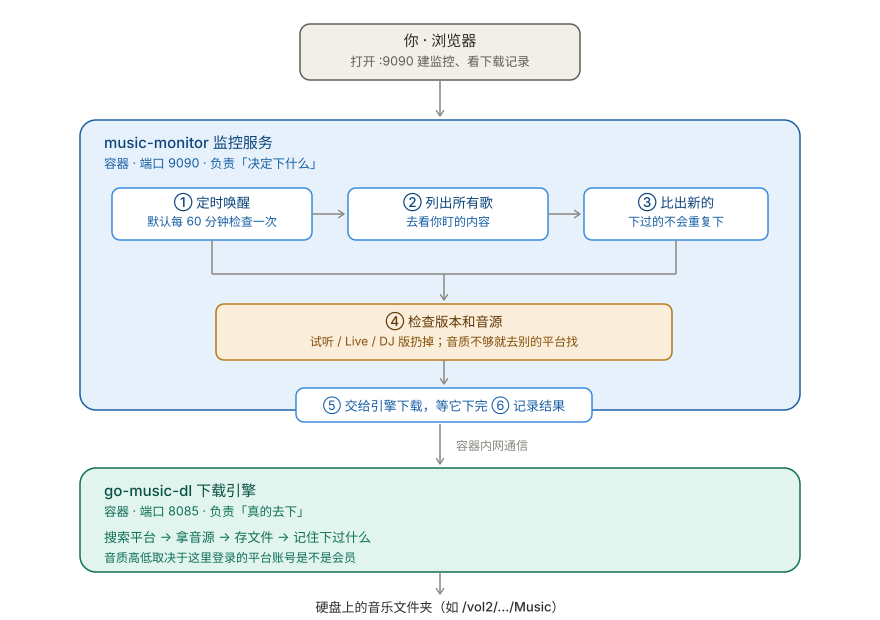
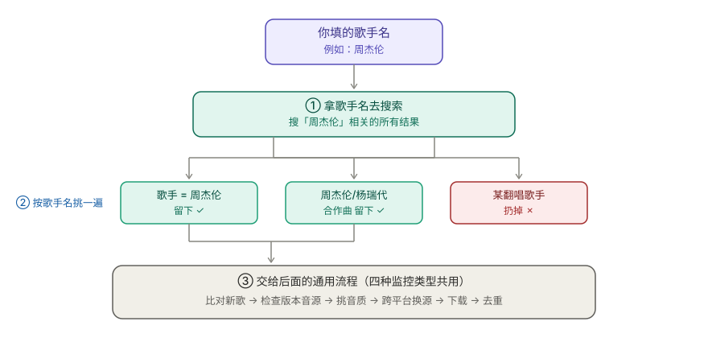

# music-monitor

一个跑在 NAS 上的音乐自动下载助手。你告诉它「我要盯什么」，它就定时去看，有新的就帮你下到硬盘里。

基于 [go-music-dl](https://github.com/guohuiyuan/go-music-dl) 构建。

能盯四种东西：

| 盯什么 | 适合什么场景 |
|---|---|
| **热门榜单** | 不想错过每天的飙升榜、新歌榜、热歌榜 |
| **指定歌单** | 别人维护的歌单更新了，你这边跟着下 |
| **个人收藏夹** | 你在手机上点了红心，NAS 里自动多一首歌 |
| **歌手关注** | 你喜欢的歌手发新歌了，自动收到 |

下载之前它会先做些检查，尽量避免下到没用的东西：试听片段、现场版、演唱会版、DJ 版、Remix 版通常会被跳过，只有实在找不到正式版的时候才会拿来兜底。

## 一张图看懂它是怎么跑的



一句话总结分工：**music-monitor 是「大脑」，负责决定下什么；go-music-dl 是「手」，负责真的去下。**

流程走一遍是这样的：

1. **定时唤醒** —— 默认每 60 分钟检查一次
2. **列出所有歌** —— 去看你盯的榜单 / 歌单 / 收藏夹 / 歌手
3. **比出新的** —— 和你下过的对比，挑出没下过的
4. **检查版本和音源** —— 试听、Live、DJ 版扔掉；音质不够就去别的平台找
5. **交给引擎下载** —— 一首一首来，等它确认下完
6. **记录结果** —— 成功 / 失败 / 跳过，以及跳过原因

## 主要功能

- 盯热门榜单、指定歌单、个人收藏夹、你关注的歌手
- 发现新歌自动下载，下过的不会重复下
- 支持网易云、QQ 音乐、酷狗、酷我、咪咕、汽水、哔哩哔哩等平台
- 下载前先检查音源能不能用、码率够不够
- 正式版优先，改编版只在没正式版时才用
- 自动跳过试听片段、Live、现场、演唱会、跨年、DJ、混音、Remix 等版本
- 一首一首下，失败了自动重试，不会一口气丢一堆任务给引擎
- 监控配置、下载记录、平台登录状态都会存下来，重启容器不丢

## 内置榜单

内置榜单按平台分好组了，界面上可以先点「校验」看看能不能取到歌，再点「创建监控」：

| 平台 | 榜单从哪来 | 有哪些 |
|---|---|---|
| 网易云音乐 | 官方歌单 | 飙升榜、新歌榜、热歌榜、原创榜等 |
| QQ 音乐 | 平台榜单接口 | 热歌、新歌、飙升、流行指数、内地、欧美、日本、韩国、香港地区、台湾地区、网络歌曲、抖音热歌、国风热歌、DJ 舞曲 |
| 酷狗音乐 | 平台榜单接口 | TOP500、飙升、新歌、内地、欧美、香港地区、台湾地区、韩国、日本、粤语金曲、网络热歌、会员热歌、DJ 热歌、民谣、电音、JOOX 香港热歌 |
| 酷我音乐 | 平台榜单接口 | 热歌榜、飙升榜、新歌榜 |

几点说明：

- 底层的 go-music-dl **只有「按歌单取歌」的能力，没有榜单功能**，而且榜单页面也不是歌单页面。所以除了网易云（它家的榜单本身就是官方歌单）之外，QQ / 酷狗 / 酷我的榜单是由本服务直接去读各平台公开接口拿的。
- 榜单编号会随平台改版而失效。某一个失效不影响其它功能，在界面上点「校验」就能自己测出来。
- **Apple Music 没内置**：底层只能拿到试听片段，而本服务会把试听片段过滤掉，结果就是一首完整的都下不到。
- **JOOX 没内置**：它的网页榜单页已经下线了，解析不出来。想用它的话，可以用「自定义歌单」粘贴 JOOX 的歌单链接。
- 任何平台都能用「自定义榜单」手动加歌单链接或歌单 ID，不受上面这份内置清单限制。

## 歌手关注

### 怎么用

在「新建监控」弹窗里，把监控类型选成「歌手关注」，然后在框里每行写一个歌手名字，保存就行：

```text
周杰伦
林俊杰
陈奕迅
```

也可以给某一位歌手单独指定去哪些平台搜，用一条竖线隔开：

```text
周杰伦
陈奕迅|qq
林俊杰|qq,kugou
```

上面的意思是：周杰伦在监控里勾选的所有平台搜；陈奕迅只在 QQ 音乐搜；林俊杰在 QQ 和酷狗搜。

保存后，它先把这位歌手现在能搜到的歌都看一遍（没下过的会下下来），之后每隔一段时间再检查一次，**只下新出现的歌**，重复的歌不会反复下。

### 它是怎么工作的

这里要说明一件事：底层的 go-music-dl **没有「把某位歌手的歌全部列出来」这种功能**，它只能按关键词搜索。

所以歌手关注用的办法是「搜 → 挑 → 再确认」三步：



第 ② 步的判断标准很简单：**一首歌的歌手字段里只要包含你要关注的那位歌手，就算数**。

- 「周杰伦」→ 留下 ✅
- 「周杰伦/杨瑞代」→ 留下 ✅（合作曲不会被漏掉）
- 「某翻唱歌手」唱了周杰伦的歌 → 扔掉 ❌（歌手名字对不上）

### 用之前需要知道的几点

因为底层靠搜索，它的行为跟榜单、歌单不太一样：

- **第一次创建会下一批**：会把当时能搜到的这位歌手的歌都过一遍，没下过的会下下来。如果你只想让它盯着新歌，第一次可以先把「自动下载」关掉，或者把「单次最多下载」调小。
- **新歌可能会晚一点**：平台把新歌收录进搜索结果需要时间，所以不是歌手一发歌就立刻能搜到，晚几个小时到一天都算正常。
- **搜到的数量有上限**：每个歌手默认最多取 100 首，可以在监控配置里调整页大小。
- **后面的流程完全一样**：挑音质、跨平台换源、去重、失败重试，这些跟榜单和歌单走的是同一套逻辑，不用担心歌手关注下载的歌质量会差一些。

## 两个容器各干什么

### music-monitor（大脑）

- 定时去看你盯的榜单、歌单、收藏夹、歌手
- 判断哪些是没下过的新歌
- 检查歌曲版本对不对、时长对不对、音源能不能用
- 挑一个最合适的来源
- 让引擎去下，等它下完
- 记录成功、失败、跳过，以及跳过的原因

### go-music-dl（手）

- 搜索和解析各个音乐平台
- 获取音源
- 把文件保存到硬盘
- 管理 Cookie 和平台登录状态
- 管理下载记录和文件名格式

一句话总结分工：**music-monitor 决定下什么，go-music-dl 负责真的去下。**

## 部署

### 用 Docker Compose 部署

先把目录建好。`config/` 用来放配置，`data/` 用来放音乐：

```text
music-monitor/
├── docker-compose.yml
├── config/
│   ├── engine/          ← 引擎的设置、平台登录状态
│   └── monitor/         ← 你建了哪些监控、下过哪些歌
└── data/
    └── downloads/       ← 下载下来的音乐文件
```

```bash
mkdir -p config/engine config/monitor data/downloads
chmod -R 777 config data      # 引擎以普通用户身份运行，必须放开写权限
docker compose up -d          # 启动
docker compose ps             # 看看起来没有
docker compose logs -f        # 有报错就看日志
```

> 如果你的设备用的是老版本 Compose，把命令里的 `docker compose` 换成 `docker-compose`。

### 飞牛 NAS（fnOS）

下面这份配置是专门给飞牛写的，可以直接复制。它的作用是：**配置存在 Compose 项目目录里，音乐存在机械硬盘上**，并且 monitor 以「只读」方式去看音乐文件在不在（不会动你的文件）。

先在飞牛上建个目录，比如：

```text
/vol1/docker/music-monitor/
```

在这个目录里新建 `docker-compose.yml`，内容整段复制：

```yaml
# 飞牛 fnOS 部署版

services:
  music-dl:
    image: docker.1ms.run/guohuiyuan/go-music-dl:latest
    container_name: go-music-dl
    restart: unless-stopped
    ports:
      - "8085:8080"
    volumes:
      - ./config/engine:/home/appuser/data
      - "/vol2/1000/机械硬盘/#media/downloads/Music:/home/appuser/data/downloads"
    environment:
      - TZ=Asia/Shanghai
    user: "1000:1000"

  monitor:
    image: docker.1ms.run/baey666/music-monitor:latest
    container_name: music-monitor
    restart: unless-stopped
    ports:
      - "9099:9090"
    volumes:
      - ./config/monitor:/app/data
      - "/vol2/1000/机械硬盘/#media/downloads/Music:/downloads:ro"
    environment:
      - ENGINE_URL=http://music-dl:8080
      - ENGINE_PREFIX=/music
      - TICK_SECONDS=60
      - DOWNLOAD_CONCURRENCY=1
      - DOWNLOAD_RETRIES=2
      - DOWNLOAD_BATCH=8
      - DOWNLOAD_BATCH_GAP=3
      - DOWNLOAD_TIMEOUT=300
      - MAX_DOWNLOADS_PER_RUN=0
      - DEFAULT_QUALITY=lossless
      - TZ=Asia/Shanghai
    depends_on:
      - music-dl
    user: "1000:1000"
```

注意：上面配置中的 `/vol2/1000/机械硬盘/#media/downloads/Music` 是示例路径，请改成飞牛上实际的音乐目录，并在两个服务的挂载项中保持一致。`monitor` 的 `:ro` 表示只读，不会修改或删除音乐文件。

在 Compose 项目目录执行：

```bash
cd /vol1/docker/music-monitor
mkdir -p config/engine config/monitor
chmod -R 777 config
docker compose pull
docker compose up -d --force-recreate
docker compose ps
```

> 老版本 Compose 把 `docker compose` 换成 `docker-compose`。

以后想更新到最新版，执行这两条就行：

```bash
docker compose pull monitor
docker compose up -d --force-recreate monitor
```

**怎么知道更新成功了？** 网页顶部会显示当前实际运行的版本号，刷新看一眼就知道。

**端口冲突怎么办？** 如果 `9099` 被别的程序占了，把左边那个数字改掉即可（右边容器内的 `9090` 不要动）：

```yaml
ports:
  - "9091:9090"        # 左边随便改，右边保持 9090
```

改完访问 `http://飞牛IP:9091`。

## 访问地址

假设你的 NAS 地址是 `192.168.10.88`：

```text
音乐下载引擎：http://192.168.10.88:8085
监控控制台：  http://192.168.10.88:9090
```

你平时用得多的是 **9090**（建监控、看下载记录），8085 只在第一次配置和登录平台时才需要打开。

## 首次初始化（一共四步）

### 1. 给 go-music-dl 设置管理员

打开 `http://NAS-IP:8085/music/setup`，它会让你输一个初始化令牌。令牌在容器日志里：

```bash
docker compose logs go-music-dl | grep "Web setup token"
```

把令牌填进去，然后自己设一个管理员账号密码（记住，以后改引擎设置要用）。

### 2. 设置下载目录

在 go-music-dl 的设置里，把「本地下载目录」填成：

```text
data/downloads
```

⚠️ **不要填 NAS 上的真实路径**（像 `/vol2/1000/...` 这种）。这里填的是**容器里面的路径**，宿主机路径已经在 Compose 里映射好了，填错会导致文件下到看不见的地方。

### 3. 登录音乐平台

在 go-music-dl 里扫码登录你要用的平台。登录状态会存到 `config/engine/cookies.json`。

**这一步直接决定能下到什么音质**：有会员 Cookie 才拿得到无损，没登录一般只能拿到普通音质。所以想要 FLAC 的话，务必在这里登录相应的平台。

是否有会员 Cookie，会影响可获取的音质和歌曲范围。

### 4. 建第一个监控

打开 `http://NAS-IP:9090`，然后：

```text
① 点「新建监控」
        │
        ▼
② 选监控类型：热门榜单 / 指定歌单 / 个人收藏夹 / 歌手关注
        │
        ▼
③ 填名称，选平台（想跨平台补源就多勾几个）
        │
        ▼
④ 点「干跑预览」 ← 强烈建议先点这一步
   它会告诉你「一共看得见几首、过滤后剩几首、有没有报错」
   如果这里就是 0 首，说明配置不对，别急着保存
        │
        ▼
⑤ 确认没问题 → 保存
        │
        ▼
⑥ 想让它自动下就把「自动下载」打开；只想先看看就先关着
```

> **「干跑预览」是什么？** 就是「先试一下但不真的下」。它是这个项目里最有用的按钮——能在你白等一轮调度之前，就告诉你的配置到底对不对。

## 配置和数据路径

默认的挂载是这三条：

```yaml
volumes:
  - ./config/engine:/home/appuser/data
  - ./data/downloads:/home/appuser/data/downloads
  - ./config/monitor:/app/data
```

看不懂没关系，记住这个规律就行：**冒号左边是「你家硬盘上的位置」，可以随便改；冒号右边是「容器里的位置」，程序写死的，别动。**

| 内容 | 在 NAS 上的位置（可改） | 在容器里的位置（别改） |
|---|---|---|
| 引擎设置和平台登录 | `config/engine/` | `/home/appuser/data/` |
| 你建的监控、下载记录 | `config/monitor/` | `/app/data/` |
| 音乐文件 | `data/downloads/` | `/home/appuser/data/downloads/` |

**想把音乐存到别的硬盘**（比如机械硬盘），只改左边：

```yaml
volumes:
  - ./config/engine:/home/appuser/data
  - "/vol2/1000/机械硬盘/#media/downloads/Music:/home/appuser/data/downloads"
  - ./config/monitor:/app/data
```

改完记得：go-music-dl 设置里的下载目录**还是填 `data/downloads`**（容器内的路径），别填 `/vol2/.../Music`。这是最容易搞混的一点。

## 下载版本规则

同一首歌，网上往往有好几个版本。下载时的挑选顺序是这样的：

```text
① 先看监控内容里的原始那首
        │
        ▼
② 优先选歌名、歌手、时长都对的「正式版」
        │
        ├── 原平台下不了？去其它平台找正式版
        │
        ▼
③ 只要找到任何正式版，就绝对不下 Live / 演唱会 / DJ / Remix
        │
        ▼
④ 实在一个正式版都找不到，才用改编版兜底
```

另外：**试听片段永远不下**（不管什么情况）。如果两个候选的时长差得太多，也会被判定为「不是同一首歌」而跳过。

## 音质说明

先说一个很多人会误会的地方：**这个服务不能「指定音质」**。

因为底层的 go-music-dl 下载接口压根没有音质参数，你实际拿到什么音质，取决于平台账号的权限：

- 平台账号登录了没有
- Cookie 还有效吗
- 这个账号有没有会员
- 这首歌有没有版权限制
- 平台这次实际返回了什么音源

那本服务做什么呢？**它帮你挑**：下载前先探一下这首歌的真实码率，如果达不到你要求的水准，就去别的平台找同一首歌的更好版本，在够格的候选里挑最好的那个。但它**没法突破 VIP 和版权限制**——想拿无损，前提是你自己登录了有会员的账号。

`.env` 里推荐的设置：

```env
DEFAULT_QUALITY=lossless     # 目标音质
DOWNLOAD_CONCURRENCY=1       # 一次下一首，稳一点
DOWNLOAD_RETRIES=2           # 失败了重试两次
DOWNLOAD_BATCH=8             # 每批推给引擎 8 首，这批下完再推下一批
DOWNLOAD_BATCH_GAP=3         # 两批之间歇 3 秒
DOWNLOAD_TIMEOUT=300         # 单首最多等 5 分钟（无损歌挺大的）
```

## 失败了、漏下了怎么办

每首歌都是**单独处理**的，而且**分批推进**——不会一口气把几百首全丢给引擎：

```text
       ┌──────────── 这一轮的上限（比如 30 首）────────────┐
       │                                                  │
  第 1 批（8 首）   ──►  全部下完 / 失败完  ──►  第 2 批（8 首） ──► …
       │                                                  │
       └──────────────────────────────────────────────────┘
```

每一批里的每首歌：

```text
检查这一首的音源
      │
      ▼
单独提交下载 ──► 等着它下完 ──► 确认真的保存成功了才记录为「已下载」
      │
      └── 失败？自动重试（默认 2 次）
```

**为什么要一首一首来？** 引擎同时接受太多任务时容易漏掉一些。慢一点，但不容易出错。

**为什么要分批？** 一次把几百首灌给引擎，上游会积压，日志两边也数不清。分批之后
「推一批、等它下完、再推下一批」，每批的进度都看得见，某首卡住也不会拖住后面的。

> 想跑完一个几百首的大歌单，把监控的「**单次最多下载**」调大就行——那才是每轮的总上限，
> 分批只是执行节奏，不会卡住总数。

### 为什么「下载数」和 go-music-dl 里的记录条数对不上？

因为**两边的记法不一样**，不是漏下：

| | 记的是什么 |
|---|---|
| 本服务的「下载」 | 这一轮**实际处理**了多少首 |
| go-music-dl 的下载记录 | 每次**收到请求**都记一条，包括「这首我库里已经有了，跳过」 |

同一首歌如果前几轮推过、这轮又推一次，引擎那边就会多出一条「跳过」记录。本服务现在会：

- 运行记录里单独给出「**引擎已有**」这一列，把这些「没产生新文件」的挑出来；
- 已经下过的歌按「歌名 + 歌手」认出来（换过平台的也算），下一轮**不会再推一遍**；
- 日志最后一行给出这一轮的口径：处理了多少首、其中多少首引擎已经有了、失败多少首。

失败的歌会清清楚楚记在监控页面里，你可以在那儿点重试，或者手动再跑一次监控。

想看详细日志：

```bash
docker compose logs -f monitor        # 监控服务（挑歌、下载的记录）
docker compose logs -f go-music-dl    # 下载引擎
```

## 常用操作

```bash
docker compose ps                 # 看看容器起来没有
docker compose logs -f monitor    # 看日志
docker compose restart monitor    # 重启监控服务
docker compose down               # 停止服务
docker compose pull               # 拉最新镜像
docker compose up -d              # 应用更新
tar czf config-backup.tar.gz config/   # 备份配置和监控记录（不含音乐）
```

## 注意事项

- `config/engine/cookies.json` 里面是你的平台登录状态，**不要公开、不要提交到 Git**
- `config/` 和 `data/` 必须持久化保存，否则删掉容器后设置和记录全没了
- 数据库必须挂**目录**，不要只挂单个 `.db` 文件（SQLite 还需要同目录下的辅助文件）
- Compose 里冒号**右边**的容器内路径不要改，只改左边的宿主机路径
- Apple Music 一般只能拿到试听片段，不适合当完整的音乐来源
- 不支持 Spotify

---

## 给开发者

<details>
<summary>点开：项目结构、接口和测试说明</summary>

### 目录结构

```text
monitor/
├── app/                    监控服务（Python FastAPI）
│   ├── api.py              HTTP 接口层
│   ├── pipeline.py         核心流程：发现 → 比对 → 择优 → 下载
│   ├── engine.py           调用 go-music-dl 的客户端
│   ├── parser.py           解析上游返回的 HTML 页面
│   ├── db.py               SQLite（监控配置、下载记录）
│   ├── charts.py           内置榜单注册表
│   ├── ranks.py            直连各平台榜单接口（上游没有榜单能力）
│   ├── quality.py          音质评估与择优
│   ├── scheduler.py        定时调度
│   └── config.py           运行期配置（环境变量）
├── web/                    前端（零构建，原生 JS）
└── tests/                  离线测试
    ├── stub_engine.py      假的 go-music-dl 服务
    └── smoke_test.py       端到端冒烟测试
```

### 监控的四种类型

`monitors.kind` 目前有四种，区别只在「怎么找到歌」，找到之后的流程完全一样：

| kind | target 结构 | 怎么发现歌 |
|---|---|---|
| `chart` | `{charts: [{key, name, platform, id, link, rank}]}` | 内置注册表 → 平台榜单接口 |
| `playlist` | `{playlists: [{name, source, id, link}]}` | 引擎按歌单 ID / 链接取 |
| `favorites` | `{playlist_ids: ["source:id"]}` | 引擎读已登录平台的个人歌单 |
| `artist` | `{artists: [{name, sources}], page_size}` | 搜索 + `exact_artist` + 本地按歌手名复核 |

### 上游能力边界（改代码前务必先看）

go-music-dl **只有**这些能力：搜索、按歌单/专辑/个人歌单取曲目、探测音源、下载。

它 **没有**榜单接口，也 **没有**「按歌手取全部歌曲」的接口。所以：

- **榜单**：本服务自己写了 `ranks.py`，直连各平台公开榜单接口拿数据
- **歌手关注**：复用搜索能力，靠 `exact_artist` 参数 + 本地 `_artist_matches()` 二次过滤
- 判断依据：`_artist_matches()` 会先做文本归一化（去括号后缀、去 feat/live 等词），然后
  「完全相等 / 互相包含 / 相似度 ≥ 0.72」三者之一即算命中。**互相包含**这条是为了不误杀
  「周杰伦/杨瑞代」这类合作曲

### 跑测试

不需要 Docker、不需要联网，`stub_engine.py` 会假装成上游服务：

```bash
cd monitor
<隔离环境的 python> -m tests.smoke_test     # 期望：通过 N 项，失败 0 项
```

### 发版

版本号的**唯一来源**是 `monitor/app/__init__.py` 里的 `__version__`，不要手改其它文件：

```bash
./scripts/version.sh bump patch | minor | major --push
```

脚本会自动同步 Dockerfile / `.env` / CHANGELOG，提交并打 tag；推 tag 会触发 GitHub Actions
构建多架构镜像并推到 Docker Hub。

</details>

