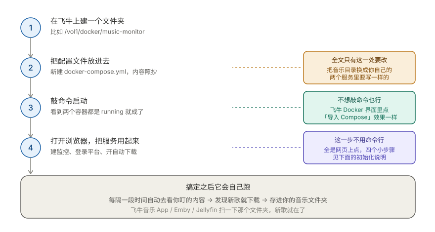

# 有了这个，NAS 自己会下歌：music-monitor 部署使用指南

> 🔗 项目地址：[github.com/Baey666/music-monitor](https://github.com/Baey666/music-monitor)
> 📦 当前版本：v1.1.0（支持 amd64 / arm64）

## 先说说它解决什么问题

我用飞牛 NAS 听歌，但一直有个麻烦事：

新歌得自己去平台上找、自己去下、自己传进音乐文件夹。喜欢的歌手发了新歌，往往过好几天才想起来去听。

这个工具就是干这件事的——**你告诉它要盯什么，剩下的它自己搞定。**

具体能盯四类东西：

| 盯什么 | 说人话就是 |
|---|---|
| **热门榜单** | 每天更新的飙升榜、新歌榜、热歌榜，不用自己去看 |
| **指定歌单** | 别人维护的歌单更新了，你这边跟着下 |
| **个人收藏夹** | 你在手机上点了红心，NAS 里自动多一首歌 |
| **关注的歌手** | 你喜欢的歌手发新歌了，自动给你下下来 |

## 它长这样


简单说就是：**监控程序负责决定下什么，下载引擎负责真的去下。**

- **上半部分（监控程序）**：定时去看你盯的内容 → 找出没下过的新歌 → 检查版本和音质 → 交给下载引擎
- **下半部分（下载引擎）**：搜索平台、拿音源、把文件存进你的音乐文件夹

两个都是 Docker 容器，装一次就不用管了。

## 怎么装：四步



### 第 1 步：建个文件夹

SSH 连上飞牛，随便找个地方建目录（我放在 `/vol1`）：

```bash
mkdir -p /vol1/docker/music-monitor
cd /vol1/docker/music-monitor
```

### 第 2 步：把配置文件放进去

在刚才那个目录里新建 `docker-compose.yml`，内容整段复制：

```yaml
services:
  music-dl:
    image: docker.1ms.run/guohuiyuan/go-music-dl:latest
    container_name: go-music-dl
    restart: unless-stopped
    ports:
      - "8085:8080"
    volumes:
      - ./config/engine:/home/appuser/data
      - "/vol2/1000/机械硬盘/#media/downloads/Music:/home/appuser/data/downloads"
    environment:
      - TZ=Asia/Shanghai
    user: "1000:1000"

  monitor:
    image: docker.1ms.run/baey666/music-monitor:latest
    container_name: music-monitor
    restart: unless-stopped
    ports:
      - "9099:9090"
    volumes:
      - ./config/monitor:/app/data
      - "/vol2/1000/机械硬盘/#media/downloads/Music:/downloads:ro"
    environment:
      - ENGINE_URL=http://music-dl:8080
      - ENGINE_PREFIX=/music
      - TICK_SECONDS=60
      - DOWNLOAD_CONCURRENCY=1
      - DOWNLOAD_RETRIES=2
      - DEFAULT_QUALITY=lossless
      - TZ=Asia/Shanghai
    depends_on:
      - music-dl
    user: "1000:1000"
```

**全文只有一处要改**：里面出现两次的 `/vol2/1000/机械硬盘/#media/downloads/Music`，换成你飞牛上真实的音乐文件夹路径。

> 注意这两处必须**写成一样的**，因为它俩指向同一个位置——一个让引擎往里写歌，一个让监控程序去看文件在不在。

### 第 3 步：启动

```bash
mkdir -p config/engine config/monitor
chmod -R 777 config
docker compose pull
docker compose up -d
docker compose ps
```

看到 `go-music-dl` 和 `music-monitor` 都是 `running` 就成功了。

> 如果你的系统不认识 `docker compose`（中间有空格那种），换成 `docker-compose`。
> 另外：**飞牛自带的 Docker 界面里点「导入 Compose」粘贴上面的内容也一样**，不想敲命令的话用这个。

### 第 4 步：打开网页把服务用起来

假设飞牛 IP 是 `192.168.10.88`，浏览器打开：

| 干什么 | 地址 |
|---|---|
| 配置引擎、登录平台 | `http://192.168.10.88:8085` |
| 建监控、看下载记录 | `http://192.168.10.88:9099` |

**9099 打不开？** 可能端口被占了，把配置文件里的 `"9099:9090"` 改成 `"9091:9090"`，然后访问 9091 就行。冒号右边那个 `9090` 别动。

## 网页上的四个小步骤

装好之后都是点鼠标，不用再碰命令行。

### ① 给引擎设管理员

打开 `http://你的IP:8085/music/setup`，会让你输一个初始化令牌。令牌在这里拿：

```bash
docker compose logs go-music-dl | grep "Web setup token"
```

填进去，然后自己设个账号密码。

### ② 设置下载目录

在 8085 的设置页面里，把「本地下载目录」填成：

```
data/downloads
```

⚠️ **这里千万别填 `/vol2/...` 那种真实路径。** 这里要填的是"容器里面"的路径。宿主机和容器之间的对应关系在配置文件里已经弄好了，你填对了它就能存进你的音乐文件夹。

### ③ 登录音乐平台

在 8085 里扫码登录你要用的平台（网易云、QQ 音乐、酷狗……）。

**这一步直接决定音质。** 有没有登录、账号是不是会员，决定了你能拿到的是普通音质还是无损。想要 FLAC，就得在这里登录有会员的账号。

登录状态会存到 `config/engine/cookies.json`，重启不会掉。

### ④ 建第一个监控

打开 9099，点「新建监控」，然后：

1. 选类型（榜单 / 歌单 / 收藏夹 / 歌手）
2. 选平台，多勾几个没坏处——原平台音质不够时它会去别的平台找
3. **先点「干跑预览」** ← 这一步强烈建议别跳过
4. 确认没问题再保存，然后把「自动下载」打开

> **为什么要先预览？** 它会告诉你"能看到几首歌、过滤后剩几首、有没有报错"，但不会真的下载。如果这里显示 0 首，说明配置不对，改完再保存，省得白等一轮。

## 关于音质，先说清楚一件事

**这个工具不能"指定音质"**，因为它用的下载接口压根没有这个参数。

你能拿到什么音质，取决于平台账号的权限。它做的是**帮你挑**：

- 下载前先探一下这首歌的真实码率
- 达不到你要求的水准，就去别的平台找同一首歌的更好版本
- 在够格的候选里挑最好的那个

但它**没法突破 VIP 和版权限制**。想要无损，前提是你自己登录了有会员的账号。

想改目标音质，在配置文件里改这一行：

```yaml
- DEFAULT_QUALITY=lossless     # 可选 standard / high / lossless / hires
```

## 它不会下错版本

自动下载最怕的就是下到乱七八糟的版本。这个工具在这块做了些检查，挑选顺序是：

```text
① 先看监控内容里原始的那首歌
        │
        ▼
② 优先选歌名、歌手、时长都对得上的「正式版」
        │
        ├── 原平台下不了？去别的平台找正式版
        │
        ▼
③ 只要找到任何正式版，就绝不下 Live / 演唱会 / DJ / Remix
        │
        ▼
④ 实在一个正式版都没有，才用改编版兜底
```

另外**试听片段永远不下**（不管什么情况）。如果某首歌只能找到 30 秒的试听版，它会宁可不下。

## 日常维护也就三条命令

```bash
docker compose ps                        # 看看容器起来没有
docker compose logs -f monitor           # 看日志（挑歌、下载的记录都在这）
docker compose pull monitor              # 更新到最新版
docker compose up -d --force-recreate monitor
```

**怎么知道更新成功了？** 网页顶部显示当前运行的版本号，刷新看一眼就知道。

**备份**：配置、登录状态、监控记录全在 `config/` 目录里，几 MB 而已：

```bash
tar czf config-backup.tar.gz config/
```

音乐文件不在这里面，在你自己指定的音乐目录里。

## 几个常见问题

**Q：监控显示已下载，但文件夹里没有？**
确认你的 monitor 镜像是最新版（v1.0.5 起会核对文件是否真实存在）。另外检查第 2 步里那两处路径是不是写的一样。

**Q：某首歌一直下不下来？**
多半是 VIP 或版权限制。先去 8085 手动搜这首歌试试，能搜到但下不了就是账号权限问题。

**Q：下到了演唱会版 / DJ 版？**
把镜像更新到 v1.0.4 以上重建容器，从那个版本起才有完整的版本过滤。

**Q：支持 Apple Music 或 Spotify 吗？**
都不行。不支持 Spotify；Apple Music 只能拿到试听片段，而本工具会过滤试听片段，所以拿不到完整的歌。

**Q：拉取镜像失败？**
在飞牛的 Docker 设置里加个镜像加速地址，比如 `https://docker.1ms.run`。

## 最后

这个项目的定位就一句话：**「发现新歌 → 挑对版本 → 下载落盘」这件事，交给 NAS，不交给你。**

配好之后，你在手机上点个红心、关注个歌单、或者就等着喜欢的歌手发新歌，家里的 NAS 会默默把歌备好。回家连上 Wi-Fi，新歌已经在播放列表里了。

觉得有用的话，欢迎到 [GitHub 仓库](https://github.com/Baey666/music-monitor) 点个 Star ⭐

> 本项目基于开源项目 [go-music-dl](https://github.com/guohuiyuan/go-music-dl) 构建，仅用于个人学习与 NAS 私有部署。音乐版权归各平台及版权方所有，请勿用于商业用途。
